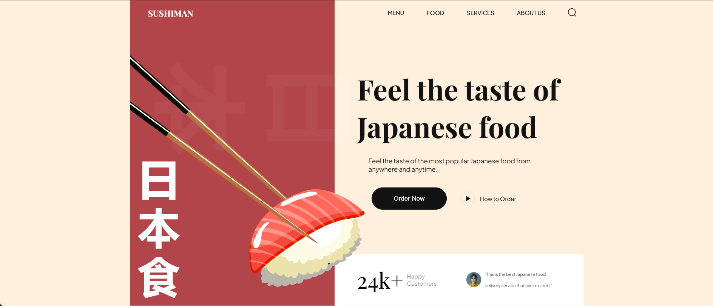

# 🍣 Sushiman UI

A modern, responsive landing page for a Japanese restaurant — built with vanilla HTML, CSS, and JavaScript, featuring smooth scroll animations and a clean, modular codebase.



[](https://developer.mozilla.org/en-US/docs/Web/HTML)
[](https://developer.mozilla.org/en-US/docs/Web/CSS)
[](https://developer.mozilla.org/en-US/docs/Web/JavaScript)
[](https://vitejs.dev/)
[](https://vercel.com/)

#### 🔗 Live Demo : [sushiman-ui.vercel.app →](https://sushiman-ui.vercel.app)


## Features

- **Fully Responsive** — adapts seamlessly across mobile, tablet, and desktop screens
- **Modern Restaurant UI** — clean, minimal aesthetic tailored for a Japanese dining experience
- **Smooth Animations** — scroll-triggered reveals powered by [AOS (Animate On Scroll)](https://michalsnik.github.io/aos/)
- **BEM Architecture** — predictable, scalable class naming for maintainable CSS
- **Modular Structure** — styles and scripts organized by component/section for easy navigation
- **Cross-Browser Compatible** — tested across modern browsers and devices

## Tech Stack

| Category   | Technology |
|------------|------------|
| Markup     | HTML5      |
| Styling    | CSS3 (BEM) |
| Scripting  | JavaScript |
| Build Tool | Vite       |
| Animation  | AOS        |
| Hosting    | Vercel     |

## Project Structure

```text
Sushiman/
├── index.html      # Main HTML entry point
├── CSS/             # Modular stylesheets (BEM-based)
├── JS/              # JavaScript modules
├── assets/          # Images, icons, fonts
├── preview/         # README preview screenshots
├── public/          # Static public assets
└── package.json     # Project metadata & dependencies
```

## 🚀 Getting Started

### Prerequisites

- [Node.js](https://nodejs.org/) (v16 or higher recommended)
- npm (comes bundled with Node.js)

### Installation

```bash
# Clone the repository
git clone https://github.com/iharshkaran/Sushiman.git

# Navigate into the project
cd Sushiman

# Install dependencies
npm install

# Start the development server
npm run dev
```

The app will run locally at `http://localhost:5173` (default Vite port).

### Build for Production

```bash
npm run build
```

## Acknowledgements

Design inspired by a [JavaScript Mastery](https://www.youtube.com/@javascriptmastery) tutorial and rebuilt as a frontend practice project.


## Author
Built with ❤️ by Harsh