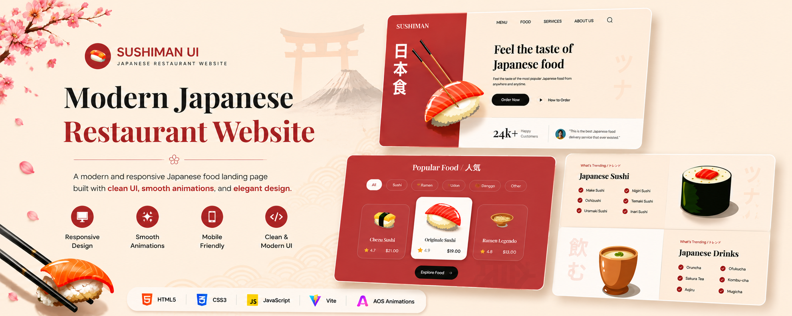

<div align="center">
  

  # Sushiman UI
</div>

A modern and responsive Japanese restaurant landing page built as a frontend revision project.

🌐 **Live Demo:** [sushiman-ui.vercel.app](https://sushiman-ui.vercel.app)

---

## About the Project

I built this over a weekend just to get back to frontend basics after a hectic college week.

It's a landing page for a Japanese restaurant — with sections for popular food items, trending dishes, drinks, and a newsletter signup. Nothing too complex, but I ended up learning way more than I expected while building it.

---

## What I Learned

A few things I was trying for the first time here:

- **BEM Naming Convention** — organizing class names in a cleaner, more readable way
- **Separate CSS Files** — instead of one giant messy file, I split styles by section
- **AOS (Animate On Scroll)** — added smooth scroll animations, honestly my favorite part
- **Vite** — used it as a build tool for the first time, way faster than I expected
- **Vercel Deployment** — took about 5 minutes, felt like magic

---

## Built With


---

## Project Structure

```
Sushiman/
├── index.html
├── CSS/
│   └── (section-wise css files)
├── JS/
│   └── script.js
├── assets/
│   └── (images, icons)
├── public/
├── .gitignore
├── package.json
└── package-lock.json
```

---

## Getting Started

If you want to run it locally:

```bash
# clone the repo
git clone https://github.com/iharshkaran/Sushiman.git

# go into the folder
cd Sushiman

# install dependencies
npm install

# start the dev server
npm run dev
```

---

## Acknowledgements

Design inspired by a JavaScript Mastery tutorial. Built and deployed independently as a learning exercise.
